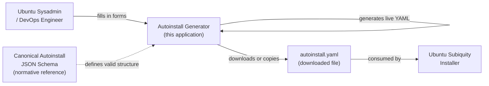
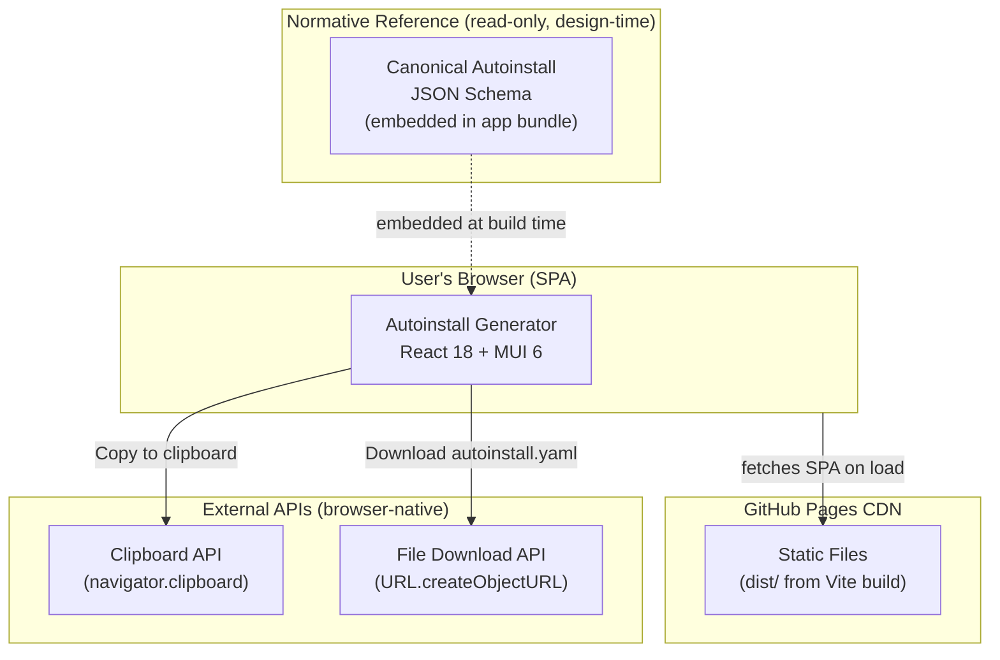

# §03 Context and Scope

**Generated:** 2026-03-31
**Sources:** `SPEC.md` §Ziel der Anwendung, §Navigation, §Exportfunktionen, `architecture/questions/resolved-questions.md` (Q-5), ADR-001, ADR-002

---

## 3.1 Business Context

The application sits between the user and Ubuntu's unattended installation mechanism. Its sole
purpose is to lower the barrier to creating valid `autoinstall.yaml` files.

**User interaction:** The user opens the application in a browser, fills in form fields across
up to 26 Autoinstall sections (organized into 6 Tab groups — ADR-004), views the live YAML
preview, and exports the result as a file download or clipboard copy. No account, login, or
server interaction is required. (SPEC.md, §Ziel der Anwendung)

**YAML consumer:** The downloaded `autoinstall.yaml` file is consumed by Ubuntu's Subiquity
installer during an unattended installation. The application has no knowledge of or control
over this consumption — it is the user's responsibility to place the file in a location
accessible to the installer. (Source: Canonical Autoinstall reference)

---

## 3.2 Technical Context

The application is a pure client-side SPA. All processing happens in the user's browser.
There is no backend, no API, and no persistent storage.

### External Interfaces

| External System | Interface | Direction | Notes |
|----------------|-----------|-----------|-------|
| **GitHub Pages CDN** | HTTPS — static file serving | User browser → CDN | Serves the SPA bundle (`dist/`) on initial page load. No runtime API calls. (ADR-002) |
| **Clipboard API** (`navigator.clipboard`) | Browser Web API | App → browser | Used for "Copy to clipboard" export action. Requires HTTPS (secure context). Fallback: display `<textarea>` for manual copy if API unavailable. (SPEC.md, §Exportfunktionen; Q-11, resolved) |
| **File Download API** (`URL.createObjectURL`) | Browser Web API | App → browser | Used to trigger `autoinstall.yaml` file download. Supported in all evergreen browsers. (SPEC.md, §Exportfunktionen) |
| **Canonical Autoinstall JSON Schema** | Static JSON — embedded in bundle | Build-time embed | The schema is embedded at build time and used for structural validation reference. It is not fetched at runtime. If Canonical updates the schema, the bundle must be rebuilt. (SPEC.md, §JSON Schema; Risk: schema drift — see §11) |

### What Is NOT External

The following are explicitly **inside** the system boundary (handled entirely client-side):

- YAML generation (`yaml.stringify()` — no server round-trip)
- Form validation (Zod schemas — entirely in-browser)
- Application state (`AutoinstallConfig` reducer — in-memory, no persistence)
- Syntax highlighting (PrismJS — bundled, no CDN fonts or scripts)

---

## 3.3 Scope Boundaries

### In Scope

| Capability | Implementation |
|-----------|---------------|
| Structured form for 24 Autoinstall sections | React Hook Form + MUI 6 + Zod |
| YAML editor escape hatch for Network (Netplan) | `YamlEditorDialog` (MUI Dialog + `<textarea>`) |
| YAML editor escape hatch for Storage Action mode | `YamlEditorDialog` (MUI Dialog + `<textarea>`) |
| User-Data section (cloud-init `users` module) | Structured form (bounded field set) |
| Live YAML preview with syntax highlighting | `react-syntax-highlighter` (PrismJS) |
| Copy to clipboard | Clipboard API |
| Download as `autoinstall.yaml` | File Download API |
| Per-section Zod validation with inline error display | Zod + React Hook Form |

(ADR-001; SPEC.md §Formular-Editor, §Exportfunktionen)

### Out of Scope (v1)

| Capability | Rationale |
|-----------|----------|
| Separate Export page | Redundant — export actions are in the Form Editor (Q-5, resolved) |
| YAML import (load existing file for editing) | Deferred to v2 (SPEC.md, §Erweiterbarkeit) |
| Internationalization (i18n) | Deferred to v2 (SPEC.md, §Erweiterbarkeit) |
| Dark mode | Deferred to v2 (SPEC.md, §Erweiterbarkeit) |
| QR code export | Deferred to v2 (SPEC.md, §Exportfunktionen) |
| Guided wizard (Stepper) for novice users | Deferred to v2 (ADR-004) |
| Server-side storage or user accounts | Not in application concept; pure client-side SPA |
| Full cloud-init YAML editor (all modules) | Only `users` module in v1 (ADR-001) |
| Full Netplan structured form | Structurally unbounded; YAML editor escape hatch used instead (ADR-001) |

---

## Cross-References

- Application goals and stakeholders: [§01 Introduction and Goals](01-introduction-and-goals.md)
- Technical and organizational constraints: [§02 Constraints](02-constraints.md)
- How the Clipboard API fallback is implemented: [§06 Runtime View](06-runtime-view.md)
- Deployment infrastructure (GitHub Pages): [§07 Deployment View](07-deployment-view.md)
- Schema drift risk (Canonical schema updates): [§11 Risks and Technical Debt](11-risks-and-technical-debt.md)
- Glossary terms: [§12 Glossary](12-glossary.md) (Autoinstall, Netplan, cloud-init)
