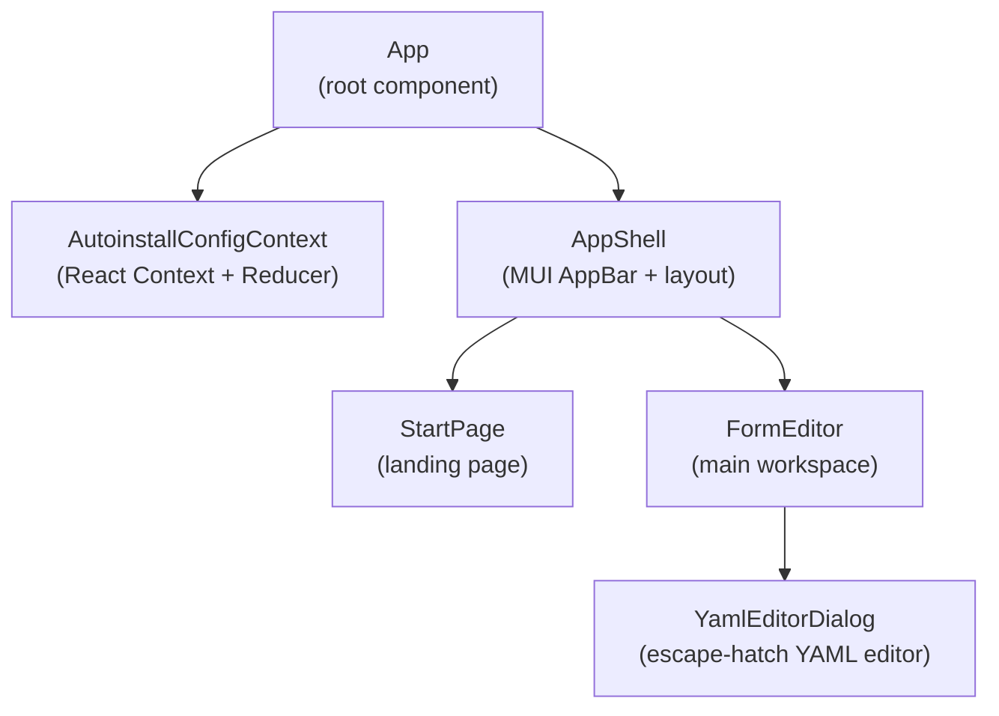
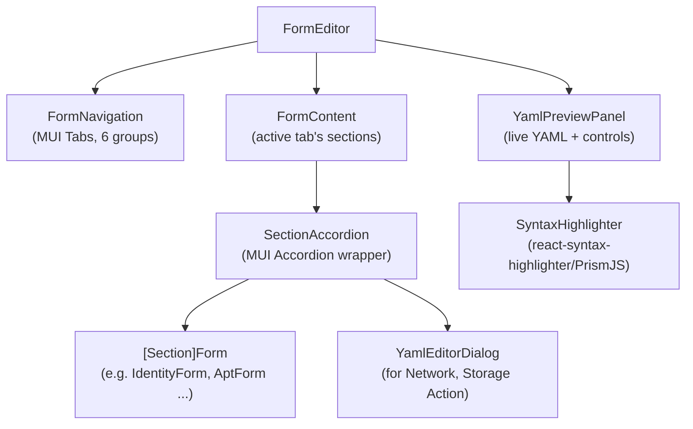

# §05 Building Block View

**Generated:** 2026-03-31
**Sources:** `SPEC.md` §Seiten & Navigation, §Formular-Editor, §Formularstruktur, §Komponenten, §Datenmodell; ADR-001, ADR-004; `architecture/questions/resolved-questions.md` (Q-1, Q-4, Q-5)

---

## Level 1 — System Decomposition

The application decomposes into the following top-level building blocks:



### Building Blocks (Level 1)

| Building Block | Responsibility | Key Interfaces |
|---------------|---------------|----------------|
| `App` | Root component; provides `AutoinstallConfigContext` to the entire tree; renders `AppShell` | — |
| `AutoinstallConfigContext` | React Context + Reducer holding the full `AutoinstallConfig` state. Exposes `state` and `dispatch` to all consumers. | `dispatch(action)`, `useAutoinstallConfig()` hook |
| `AppShell` | MUI `AppBar` with application title and optional controls (GitHub link — SPEC.md §Navigation); routes between `StartPage` and `FormEditor` | `currentPage: 'start' | 'editor'` |
| `StartPage` | Landing page with brief introduction and "New project" button that navigates to `FormEditor` | `onStartProject: () => void` |
| `FormEditor` | Main workspace: `FormNavigation` (Tabs) + `FormContent` (active section forms) + `YamlPreviewPanel`. Parent component that coordinates between form sections and YAML output. | — |
| `YamlEditorDialog` | Escape-hatch YAML editor rendered as MUI Dialog. Used by exactly 2 sections: Network (Netplan YAML) and Storage Action mode. Accepts current raw YAML string, allows editing, runs a YAML parse check on confirm, and dispatches the updated raw string to the reducer. | `open: boolean`, `section: 'network' | 'storage-actions'`, `value: string`, `onConfirm: (yaml: string) => void`, `onClose: () => void` |

> ⚠️ Inferred: The page routing between `StartPage` and `FormEditor` is derived from the two
> pages described in `SPEC.md` §Seiten & Navigation (the Export page was removed per Q-5).
> No routing library is specified; client-side state (`useState`) is sufficient given only 2 pages.
> A router library (React Router) may be added if deep-linking to specific sections is required
> in a future version.

---

## Level 2 — FormEditor Decomposition

The `FormEditor` building block decomposes as follows:



### Building Blocks (Level 2)

| Building Block | Responsibility |
|---------------|---------------|
| `FormNavigation` | MUI `Tabs` component rendering the 6 logical tab groups (System, Network, Storage, Identity & Auth, Software, Configuration). Notifies `FormEditor` of the active group. (ADR-004) |
| `FormContent` | Renders the sections belonging to the currently active Tab group. Each section is wrapped in a `SectionAccordion`. |
| `SectionAccordion` | MUI `Accordion` wrapping a single form section. Provides expand/collapse within a Tab group. Sections with a single field (e.g., proxy) may omit the Accordion for simplicity. |
| `[Section]Form` | One component per Autoinstall section (e.g., `LocaleForm`, `IdentityForm`, `AptForm`, `StorageForm`, `SshForm` …). 24 components use structured MUI form fields; 2 sections (`NetworkSection`, `StorageActionSection`) render a trigger button that opens `YamlEditorDialog`. |
| `YamlPreviewPanel` | Renders the live `autoinstall.yaml` via `SyntaxHighlighter` (PrismJS, YAML grammar). Contains "Copy" (Clipboard API) and "Download" (`URL.createObjectURL`) buttons. Reads state from `AutoinstallConfigContext`. |
| `SyntaxHighlighter` | `react-syntax-highlighter` component with PrismJS backend, YAML grammar, and one theme. Read-only display; not an editor. (ADR-003) |

---

## Tab Group Contents (Detail)

The 6 tab groups and their constituent sections, as decided in ADR-004:

| Tab Group | Sections | UI Type |
|-----------|---------|---------|
| **System** | `version` | Number field (required) |
| | `interactive-sections` | String array field (Tag input or comma-separated) |
| | `refresh-installer` | Boolean toggle + string field |
| | `early-commands`, `late-commands`, `error-commands` | String array fields |
| **Network** | `network` | `YamlEditorDialog` button (Netplan YAML escape hatch) |
| | `proxy` | TextField (URI format) |
| **Storage** | `storage` — Layout mode | Radio group: `lvm` (default) / `direct` / `zfs` |
| | `storage` — Action mode | `YamlEditorDialog` button (toggle from Layout mode) |
| **Identity & Auth** | `identity` | TextFields: realname, username, hostname, password (required) |
| | `active-directory` | TextFields: admin-name, domain-name |
| | `ubuntu-pro` | TextField: token (24–30 chars, pattern validated) |
| | `ssh` | Switch (install-server), String array (authorized-keys), Switch (allow-pw) |
| **Software** | `source` | Switch (search_drivers), TextField (id) |
| | `apt` | Switch (preserve_sources_list), Select (fallback), Switch (geoip), complex mirror config |
| | `codecs`, `drivers` | Switch (install) |
| | `oem` | Select: `true` / `false` / `"auto"` (required) |
| | `snaps` | Table: rows of {name, channel, classic} |
| | `packages` | String array (Tag input or multiline) |
| | `kernel` | Radio: `package` or `flavor` (mutually exclusive) + TextField |
| | `kernel-crash-dumps` | Nullable boolean (Select or tri-state Switch) |
| **Configuration** | `timezone` | TextField (or Select from tz database) |
| | `updates` | Select: `security` / `all` |
| | `shutdown` | Select: `reboot` / `poweroff` |
| | `reporting` | Dynamic map: add named handlers with `type` + extra fields |
| | `user-data` | Structured form: cloud-init `users` module fields (name, gecos, passwd, groups, shell, lock_passwd) |
| | `debconf-selections` | Multiline TextField |
| | `zdevs` | Table: rows of {id, enabled} |

---

## Data Model

The `AutoinstallConfig` TypeScript interface (from `SPEC.md` §Datenmodell) is the canonical state
type managed by `AutoinstallConfigContext`. Zod schemas for each section correspond to the fields
of this interface.

```typescript
interface AutoinstallConfig {
  version: number;                          // required
  interactiveSections: string[];
  earlyCommands: string[];
  lateCommands: string[];
  errorCommands: string[];
  locale?: string;
  keyboard?: KeyboardConfig;
  refreshInstaller?: RefreshInstallerConfig;
  source?: SourceConfig;
  network?: any;                            // raw Netplan YAML string (escape hatch — ADR-001)
  proxy?: string;
  apt?: AptConfig;
  storage?: StorageConfig;                  // layout mode: typed; action mode: raw YAML in StorageConfig
  identity?: IdentityConfig;
  activeDirectory?: ActiveDirectoryConfig;
  ubuntuPro?: UbuntuProConfig;
  ssh?: SSHConfig;
  codecs?: { install: boolean };
  drivers?: { install: boolean };
  oem?: { install: boolean | "auto" };
  snaps?: SnapConfig[];
  debconfSelections?: string;
  packages?: string[];
  kernel?: KernelConfig;
  kernelCrashDumps?: { enabled: boolean | null };
  timezone?: string;
  updates?: "security" | "all";
  shutdown?: "reboot" | "poweroff";
  reporting?: ReportingConfig;
  userData?: UserDataConfig;               // typed: cloud-init users module (replaces earlier `any`) — ADR-001
  zdevs?: ZDevConfig[];
}
```

(Source: `SPEC.md` §Datenmodell; ADR-001 §Consequences — `userData?: any` replaced with typed `UserDataConfig`)

---

## Scope Note: Export Page Removed

The specification mentions an optional "Export page" (`SPEC.md` §Seiten & Navigation). This page
has been removed from the building block view. Export functionality (Copy to clipboard, Download
as `autoinstall.yaml`) is provided directly in the `YamlPreviewPanel` within the `FormEditor`.
A separate page adds no new functionality. (Q-5, resolved)

---

## Cross-References

- Hybrid model rationale: [§09 Architecture Decisions — ADR-001](09-architecture-decisions.md#adr-001-hybrid-ui-model)
- Tab group rationale: [§09 Architecture Decisions — ADR-004](09-architecture-decisions.md#adr-004-form-navigation--grouped-mui-tabs)
- Runtime interaction scenarios (YAML update, escape hatch, download): [§06 Runtime View](06-runtime-view.md)
- State management and YAML serialization crosscutting concepts: [§08 Crosscutting Concepts](08-crosscutting-concepts.md)
- Syntax highlighting implementation: [§08 Crosscutting Concepts — Syntax Highlighting](08-crosscutting-concepts.md#syntax-highlighting)
