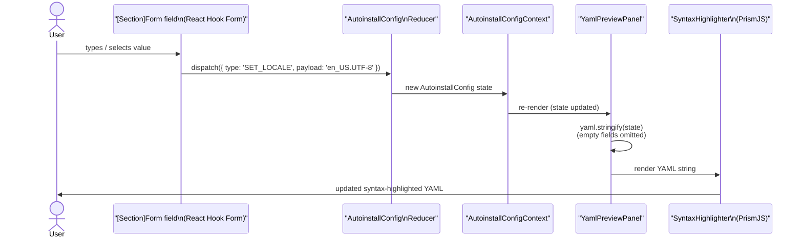
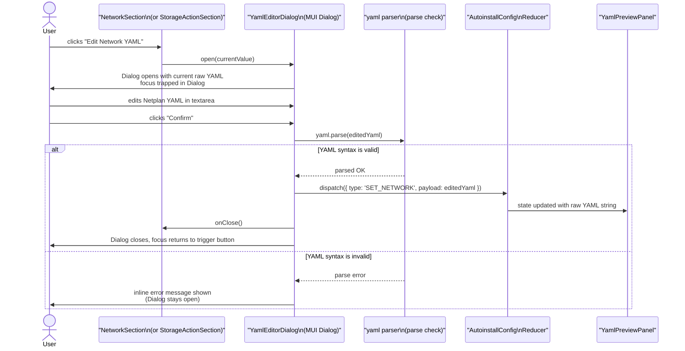
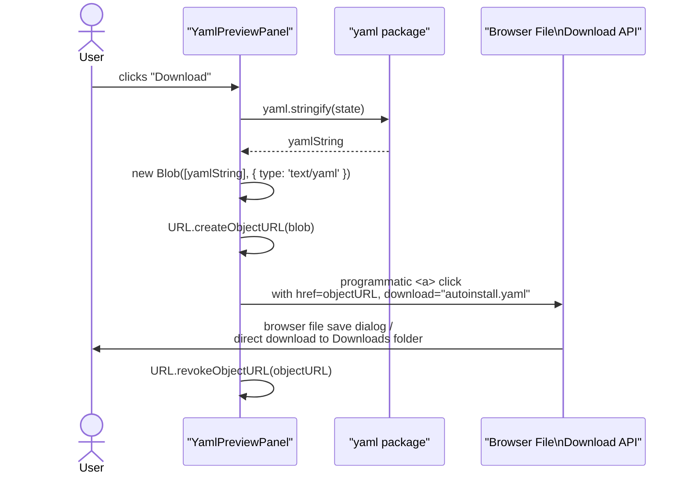
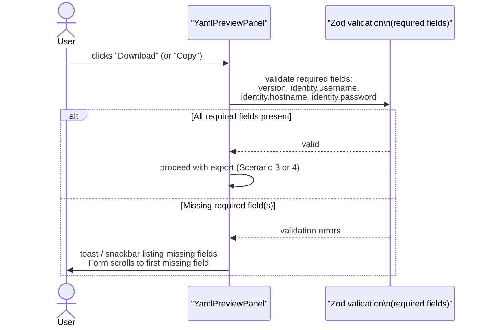

# §06 Runtime View

**Generated:** 2026-03-31
**Sources:** `SPEC.md` §YAML-Preview, §Exportfunktionen, §Formular-Editor; ADR-001, ADR-003, ADR-005; `architecture/questions/resolved-questions.md` (Q-1, Q-5, Q-11)

---

This section describes the key runtime scenarios as sequence diagrams. All processing is
client-side; there are no network calls after the initial SPA load.

---

## Scenario 1: Form Input → Live YAML Preview Update

This is the primary interaction pattern. Every form field change triggers an immediate YAML
regeneration and preview re-render.

**Performance target:** Total latency from user input to YAML re-render < 50 ms.
(Q-10, resolved; SPEC.md §YAML-Preview: "Live-Update bei jeder Eingabe")

**Implementation note:** React Hook Form uses uncontrolled components — field changes do not
trigger a full form tree re-render. Only `YamlPreviewPanel` (which subscribes to context)
re-renders on each state change. If YAML generation latency exceeds 50 ms on profiling,
React 18's `useDeferredValue` can schedule the preview re-render as a deferred (lower-priority)
update without blocking the input field. (ADR-005)

---

## Scenario 2: YAML Editor Escape Hatch (Network or Storage Action Mode)

When the user needs to configure a structurally unbounded section (Network or Storage Action mode),
they open an embedded YAML editor dialog. (ADR-001)

**State storage:** The raw YAML string is stored in `AutoinstallConfig.network` (typed as `any`)
and serialized verbatim in the YAML output. Zod cannot validate this field; only the YAML parse
check at Dialog close time prevents malformed YAML from entering the output. (ADR-001, §Negative consequences)

**Accessibility:** The MUI Dialog provides a focus trap automatically. The trigger button
receives focus when the Dialog closes. An `aria-labelledby` attribute links the Dialog to its
title. (§02 Constraints — Accessibility)

---

## Scenario 3: Download Export

The user downloads the generated `autoinstall.yaml` file directly from the YAML Preview panel.

(Source: SPEC.md §Exportfunktionen — "Download als autoinstall.yaml"; Q-5, resolved)

---

## Scenario 4: Copy to Clipboard

The user copies the generated YAML to the system clipboard.

```mermaid
sequenceDiagram
    actor User
    participant Preview as "YamlPreviewPanel"
    participant Serializer as "yaml package"
    participant ClipboardAPI as "navigator.clipboard"

    User->>Preview: clicks "Copy"
    Preview->>Serializer: yaml.stringify(state)
    Serializer-->>Preview: yamlString

    alt HTTPS context (Clipboard API available)
        Preview->>ClipboardAPI: writeText(yamlString)
        ClipboardAPI-->>Preview: Promise resolved
        Preview->>User: toast / snackbar "Copied to clipboard"
    else non-HTTPS context (Clipboard API unavailable)
        Preview->>User: displays <textarea> with yamlString selected<br/>+ message: "Copy manually (requires HTTPS for auto-copy)"
    end
```

**Clipboard API constraint:** `navigator.clipboard.writeText()` requires a secure context (HTTPS).
GitHub Pages serves over HTTPS, so this is not a concern in production. In local development
(`http://localhost`), the Clipboard API is available because `localhost` is treated as a
secure context by all evergreen browsers. The fallback (`<textarea>` for manual copy) is
the risk mitigation for edge cases such as HTTP-served deployments. (Q-11, resolved — Risk R-4)

(Source: SPEC.md §Exportfunktionen — "Kopieren in Zwischenablage"; Q-11, resolved)

---

## Scenario 5: Required Field Validation Before Export

The application enforces required fields before the YAML can be downloaded or copied.

**Required fields** (Source: SPEC.md §Validierung):
- `version` (integer, always required)
- `identity.username` (required unless `user-data` is provided)
- `identity.hostname` (required unless `user-data` is provided)
- `identity.password` (required unless `user-data` is provided)

---

## Cross-References

- Component structure (who calls whom): [§05 Building Block View](05-building-block-view.md)
- YAML editor escape hatch decision: [§09 Architecture Decisions — ADR-001](09-architecture-decisions.md#adr-001-hybrid-ui-model)
- Clipboard API constraint: [§02 Constraints](02-constraints.md), [§11 Risks — R-4](11-risks-and-technical-debt.md)
- State management and serialization: [§08 Crosscutting Concepts](08-crosscutting-concepts.md)
