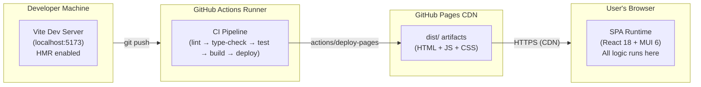
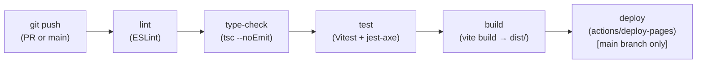

# §07 Deployment View

**Generated:** 2026-03-31
**Sources:** ADR-002; `architecture/questions/resolved-questions.md` (Q-2); `SPEC.md` §Navigation

---

## 7.1 Infrastructure Overview

The application is a **pure static SPA** with no backend. The deployment topology is minimal:

**No server-side processing occurs after deployment.** The GitHub Pages CDN serves static files.
All application logic (form rendering, YAML generation, validation, clipboard, download) runs
entirely in the user's browser. (ADR-002)

---

## 7.2 Environments

| Environment | Infrastructure | URL | Purpose |
|------------|---------------|-----|---------|
| **Development** | Vite dev server (`localhost:5173`) | `http://localhost:5173` | Local development with Hot Module Replacement (HMR). Clipboard API is available on localhost (treated as secure context by evergreen browsers). |
| **Production** | GitHub Pages CDN | `https://<username>.github.io/<repo>/` | Public deployment. HTTPS enforced. Clipboard API available. |

> 📝 TODO: The GitHub Pages URL (organization name and repository name) has not been specified
> in any source document. This should be confirmed by the maintainer and updated here.

**No staging environment** is defined for v1. GitHub Pages does not natively support PR preview
deployments; this is noted as a technical debt item in [§11](11-risks-and-technical-debt.md).

---

## 7.3 CI/CD Pipeline

The GitHub Actions pipeline runs on every push to `main` and on every pull request.

| Step | Tool | Failure behavior |
|------|------|-----------------|
| `lint` | ESLint with project rule set | Blocks merge |
| `type-check` | `tsc --noEmit` | Blocks merge |
| `test` | Vitest + `@testing-library/react` + `jest-axe` | Blocks merge (zero critical axe violations required) |
| `build` | `vite build` — outputs to `dist/` | Blocks deploy |
| `deploy` | `actions/deploy-pages` — publishes `dist/` to GitHub Pages branch | Runs only on `main`; skipped on PR branches |

(ADR-002; Q-7, resolved — `jest-axe` CI gate)

**No environment variables** are required by the build or runtime. The application has no
backend API URLs, feature flags, or secrets. The Canonical Autoinstall JSON Schema is embedded
in the source code at build time, not fetched at runtime. (ADR-002)

---

## 7.4 Build Artifacts

| Artifact | Description | Size target |
|---------|-------------|------------|
| `dist/index.html` | SPA entry point | < 5 KB |
| `dist/assets/*.js` | Bundled JavaScript (React, MUI, React Hook Form, Zod, yaml, react-syntax-highlighter, app code) | < 500 KB gzipped total (Q-10) |
| `dist/assets/*.css` | MUI styles (tree-shaken) | Included in JS bundle via CSS-in-JS; no separate CSS file |

**Tree-shaking:** Vite uses Rollup for production builds (Vite 5/6) / Rolldown (Vite 7+). MUI 6 supports tree-shaking via
named imports; only the components used in the application are included in the bundle.
`react-syntax-highlighter` is imported via deep ESM paths to avoid bundling both PrismJS
and Highlight.js backends. (ADR-003)

---

## 7.5 Deployment Mechanics

GitHub Pages deployment uses the `actions/deploy-pages` GitHub Action, which:

1. Takes the `dist/` directory as input
2. Uploads it as a GitHub Pages artifact
3. Deploys it to the repository's `gh-pages` branch (or Pages-managed storage)

**SPA routing:** The application uses client-side navigation (no URL path routing in v1 — only
two pages, both at the root URL). If URL-based routing is added in a future version, a
`404.html` redirect pattern will be needed for GitHub Pages compatibility.

**No server-side configuration** is possible on GitHub Pages (no `.htaccess`, no reverse proxy,
no custom headers beyond the defaults). All features must work without server-side support.

---

## Cross-References

- Deployment decision rationale: [§09 Architecture Decisions — ADR-002](09-architecture-decisions.md#adr-002-build-tooling-and-deployment)
- Development experience (Vite HMR, Vitest): [§08 Crosscutting Concepts — Development Experience](08-crosscutting-concepts.md#development-experience)
- Bundle size quality target: [§10 Quality Requirements](10-quality-requirements.md)
- No-PR-preview technical debt: [§11 Risks and Technical Debt](11-risks-and-technical-debt.md)
- Scope: no backend or server — [§03 Context and Scope](03-context-and-scope.md)
